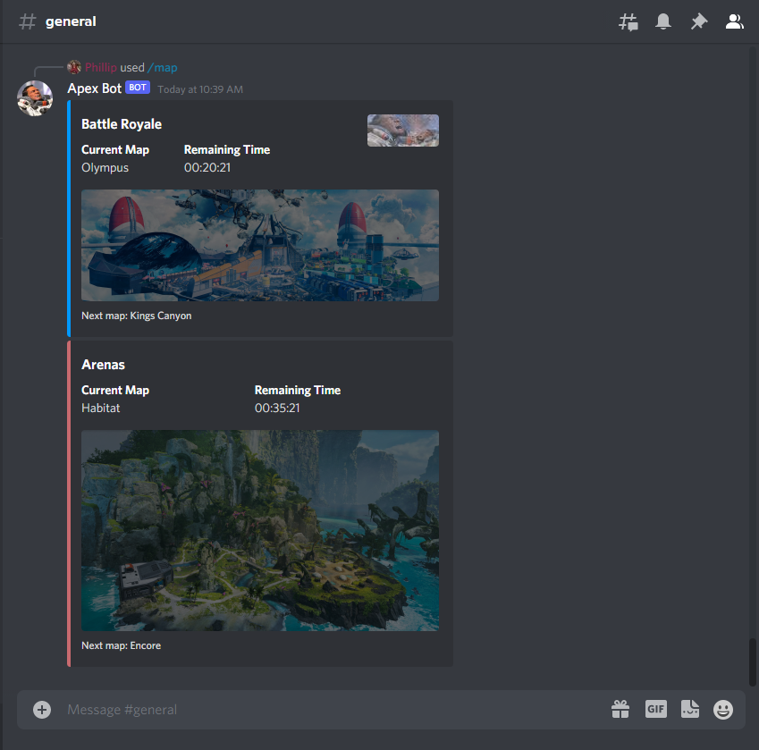

# Apex Legends Map Rotation Bot
This is a Discord Bot that provides information on the current Apex Legends Map Rotation updates and Gibby cheers you up when you're sad.

### Usage
- Use slash command `/map` or type `!map` into any channel in the server.  
   - This will return the current public and arenas map, their remaining minutes, and their next map.
- Any text message with the key phrase _"sad"_ (case not sensitive) will trigger a whole TTS (text to speech) message from Gibby.

### Screenshot
Slash command `/map`  


[Gibby TTS Demo Video](https://user-images.githubusercontent.com/81057116/156941475-f5cf20b8-4ad4-4d42-8490-fcc2dc6f8b53.mp4)

## Getting Started

### Pre-requisites
- [x] Discord Account 

### Installation
This project will use the following APIs and free services to run and host the applicationgit
- [Heroku](https://www.heroku.com/)
- [Unofficial Apex Legends API](https://apexlegendsapi.com/index.php)
- [FreshPing](https://app.freshping.io/)

#### 1. Clone and install dependencies
1. Clone this project
    ```console
    git clone 
    ```
2. Use the package manager [npm](https://www.npmjs.com/) to install the following dependencies
    ```console
    npm install 
    ```

#### 2. Environment Variables File
> ***IMPORTANT:*** *Ensure the .env file is not made available to the public i.e. not uploaded to a public repository (to workaround this, use a .gitignore file). Your tokens and secrets should be kept hidden and treated like a password as they can be misused. If they are compromised, re-issue a new token/secret from the application accordingly.*
1. Create an environments variable file called `.env` in the root directory of the project
2. Copy and paste the following into the `.env` file
    ```.env
    # DISCORD -----------------------------------------------------------------------

    ## Discord Bot Tokens
    DISCORD_TOKEN = ''

    ## Discord Bot Client Ids
    CLIENT_ID = ''

    ## Disord Server Guild Ids
    GUILD_ID = ''

    # APEX API ----------------------------------------------------------------------
    APEX_LEGENDS_API_TOKEN = ''

    # MISC --------------------------------------------------------------------------
    PORT = 5000
    ```
3. In the following next steps, we will be adding several environment variables into this file

#### 3. APEX API
1. Visit [third party Apex Legends API](https://apexlegendsapi.com/index.php)
2. Follow the instructions on the site and generate an API key
3. Copy the API key generated 
4. Paste the API key into the `.env` file `APEX_LEGENDS_API_TOKEN` variable

#### 4. Create and Add Discord Bot to Server
1. Visit [Discord Developer Portal](https://discord.com/developers/applications)
2. Sign into Discord
3. Click _New Application_ 
4. Create a name and click _Create_
5. Click on the _OAuth2 > General_ settings tab
6. In the Client ID section, click _Copy_
7. Paste the value into the `.env` file `CLIENT_ID` variable
8. Click on the _Bot_ settings tab
9. In the Token_ section, click Generate
10. Paste the value into the `.env` file `DISCORD_TOKEN` variable
11. Click on the _OAuth2 > URL Generator_ settings tab
12. In the _Scopes_ section, check `bot` and `application.commands`
13. In the _Generated URL_ section, click _Copy_
14. Paste the URL into your browser 
15. Add the Discord bot to your desired server 
16. Enable developer mode on Discord ([see instructions](https://discord.com/developers/docs/game-sdk/store#application-test-mode))
17. Right click on your desired server and click _Copy ID_
18. Paste the value into the `.env` file `GUILD_ID` variable

#### 5. Create a new Heroku app and deploy app
> _Heroku is used here, but feel free to use any hosting method (local, AWS, etc.)_
1. Visit [Heroku](https://id.heroku.com/login) and create a new account (or sign in with an existing account)
2. Click *New > Create new app*
3. Following the instructions to *Deploy using Heroku Git*
4. Visit the *Settings Tab*
5. Click on *Reveal Config Vars*
6. Copy and paste all key/values from the `.env` file into the Heroku Config Vars section
7. Click on *More > View Logs* and ensure the app has been deployed successfully

#### 6. Setup FreshPing to periodically ping Heroku app
1. Visit [Freshping](https://app.freshping.io/) and create a new account (or sign in with an existing account)
2. Click *+ Add Check*
3. Enter the Heroku app URL into the *Check URL* field
4. Set *Check interval = 5 min*
5. Click *Save*

## License
ApexBot is licensed under the [MIT license](https://github.com/philliplam8/apexbot-redo-nodejs/blob/main/LICENSE.txt)
